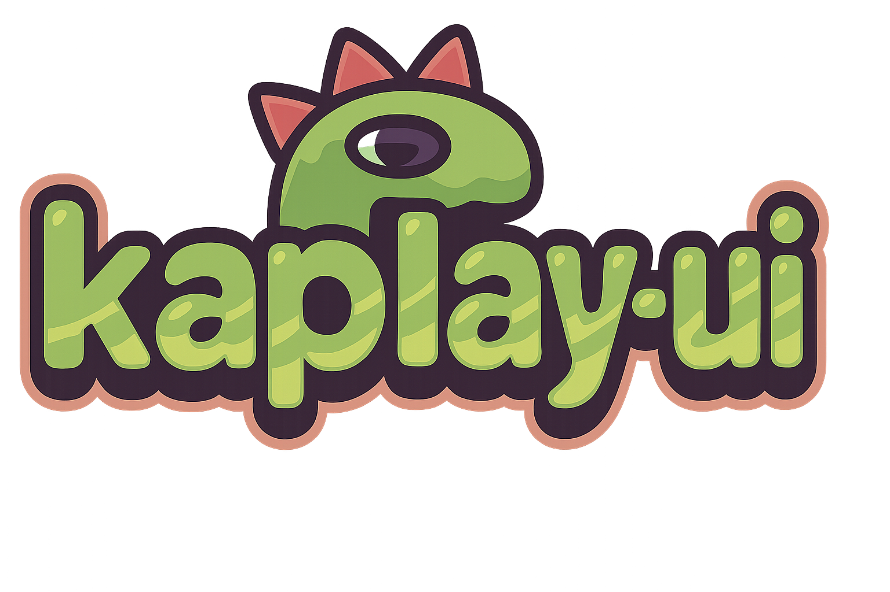

<p align="center">
  
</p>

# KAPLAY UI

_A simple and customizable UI plugin library for building interfaces in https://kaplayjs.com/._

Kaplay UI provides a game‑oriented **UI plugin** designed specifically for KAPLAY.

For now it helps you build Game Objects like text buttons and labels — without reinventing the wheel.

> ⚠️ **Note**  
> The currently published stable version (`0.20.9`) is being replaced by a complete redesign.
>
> A new **v1** version is under active development and can be installed in prerelease form (see below).

---

## 📦 Installation

### Prerelease (new v1 work)

```bash
npm install kaplay-ui@next
```

This gives you the latest `1.0.0‑alpha.*` builds.

---

## 🚀 Usage

**Kaplay UI** exports a plugin for adding UI Game Objects.

The `kaplayUI` plugin is exported from the package root:

```ts
import kaplay from "kaplay";
import kaplayUI from "kaplay-ui";

const k = kaplay({
  plugins: [kaplayUI],
});
```

You now have access to the UI helpers via your `k` instance:

```ts
const btn = k.addTextButton("Play", {width: 200, height: 100});
const label = k.addLabel("Score: 0", {radius: 10});
```

---

## 🧩 Game Objects (_**1.0.0‑alpha.\* version**_)

### 🔤 **Text Button** (`addTextButton()`)

Creates a button-like GameObj with centered text and some convenient defaults.

#### _**Signature**_

```ts
addTextButton(
  txt: string,
  opts?: object
): GameObj
```

#### _**Default values**_

| Parameter | Default    |
| --------- | ---------- |
| `txt`     | `"Button"` |
| `width`   | `200`      |
| `height`  | `100`      |

#### _**Default styling**_

When created, the button includes:

- k.outline(3)
- k.pos(0, 0)
- k.anchor("topleft")
- k.area() — for click/hover detection

#### _**Examples**_

```ts
// Button
const btn2 = k.addTextButton("Play!");

// Custom opts (only posX & posY shown here)
const btn3 = k.addTextButton("Play!", {posX: 300, posY: 200});

// Add interactivity
btn2.onClick(() => {
  console.log("Button clicked!");
});
```

---

### 🏷️ **Label** (`addLabel()`)

A lightweight text-based UI element — ideal for HUD counters, tooltips, status text, or titles.

#### _**Signature**_

```ts
addLabel(
    txt: string,
    opts?: object
)
```

#### _**Default values**_

| Parameter | Default |
| --------- | ------- |
| `txt`     | `""`    |
| `width`   | `160`   |
| `height`  | `96`    |

#### _**Examples**_

```js
// Basic label
const lbl2 = k.addLabel("Score: 0");

// Custom size
const lbl3 = k.addLabel("Start", {width: 100, height: 50});

// Update label text example
let score = 0;
const scoreLabel = k.addLabel(`Score: ${score}`);

k.wait(2, () => {
  score++;
  scoreLabel.children[0].text = `Score: ${score}`;
});
```

#### _**Common use cases**_

- HUD overlays
- Score counters
- Time and health displays
- UI section headings
- Tooltips and indicators

---

## 🛣️ Roadmap

_See evolving roadmap at: https://github.com/jbakchr/kaplay-ui/blob/v1/ROADMAP.md_

---

## 📚 License

This project is licensed under the **MIT License**.  
See the `LICENSE` file for details.

---

## 💬 Contact

Have questions or suggestions?  
Open an issue on GitHub:

👉 <https://github.com/jbakchr/kaplay-ui>
